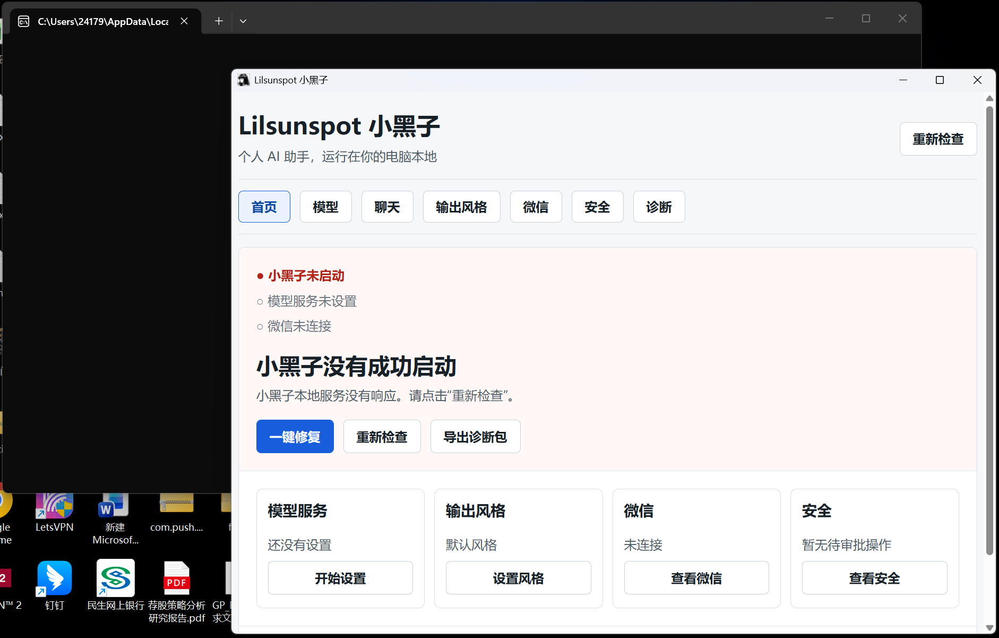
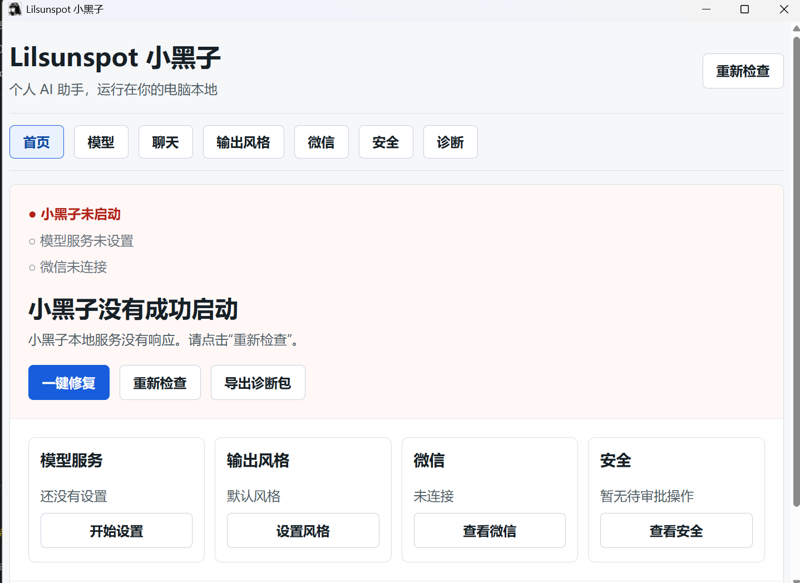
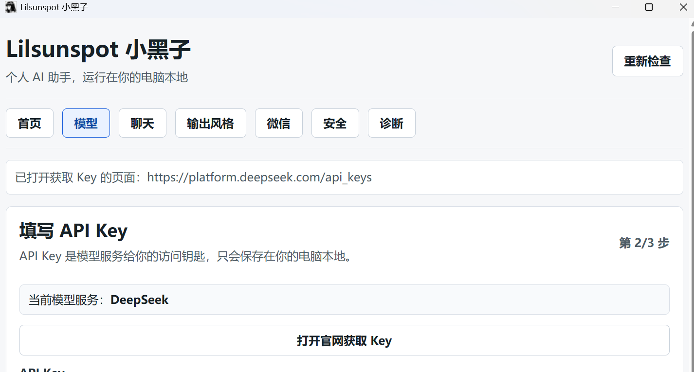
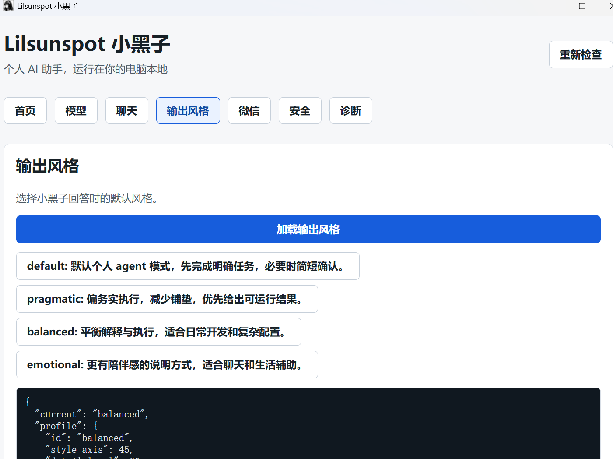
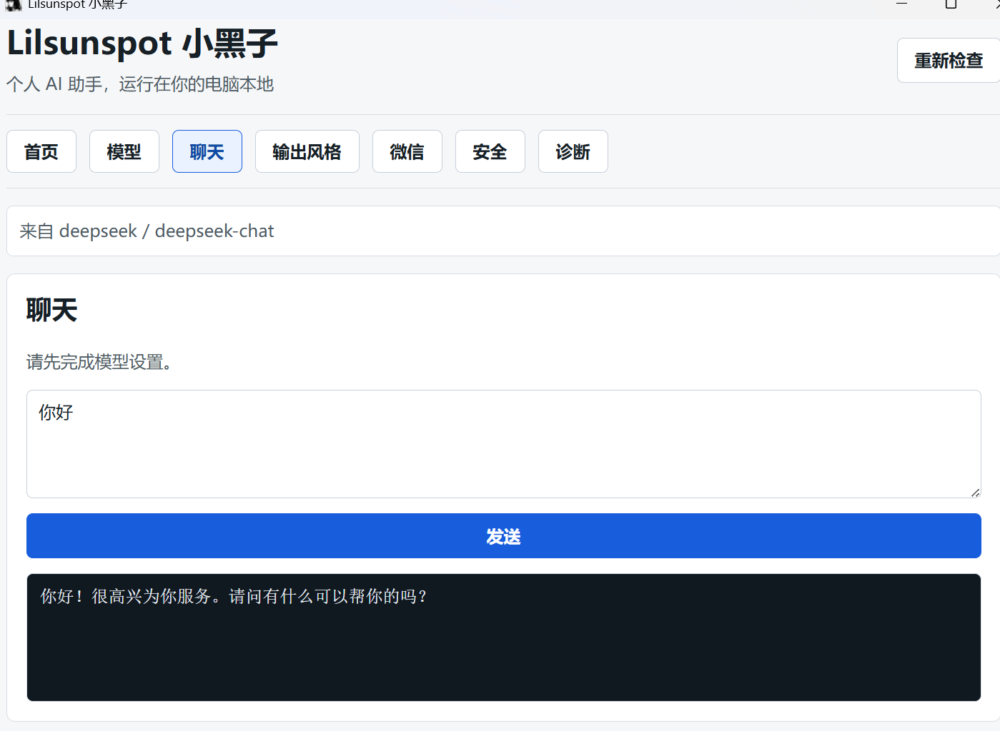
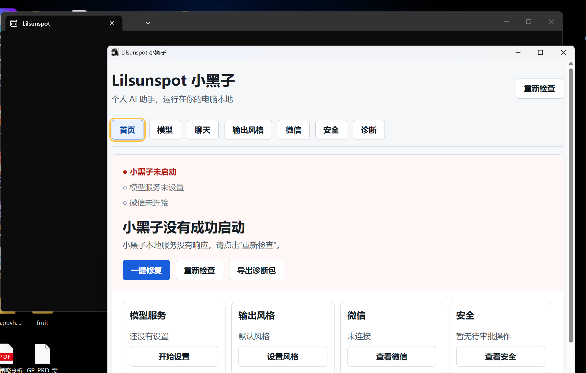

目前阶段：windows安装包测试阶段

目前，我本人测试安装包已经可以在我这台机子上安装，但是并未测试是否可以从无对应环境的windows机器上运行。

我将仅就目前所遇到的问题进行阐述，包括页面展示问题以及流程问题

1. 如图，在安装后打开桌面快捷方式，会有一个黑屏在后面，一旦关闭则整个项目会关闭，这个是明显不应该存在的事情。
2. 前端页面太丑，根本无法吸引用户。
3. 刚安装完，流程应该是先设置而不是先展示未连接，这个对小白用户并不友好。
4. 此界面的文本说明过于草率，应该有如何找到apikey的详细介绍说明，这样方便小白用户使用
5. 这个界面是最不好的，无法确认是否选择成功，也许是这个部分还未做完，不过这个和我所想要的，用横向滚动条实现切换完全不一致。
6. 聊天界面过于丑陋，而且目前这个对话框在输入过后并不会自动换成新空输入框，而是还保有上一次输入，不符合输入正常逻辑。
7. 不保存用户apikey，每次都需要重新搞，我知道这是出于安全考虑，但是这个是用户的本机啊，用户本机肯定要保存用户的apikey啊，你不能每次都让用户搞一遍吧，这个apikey不暴露仅限在我这个仓库内，因为这个仓库是个public的，但是用户本机环境完全没问题啊。